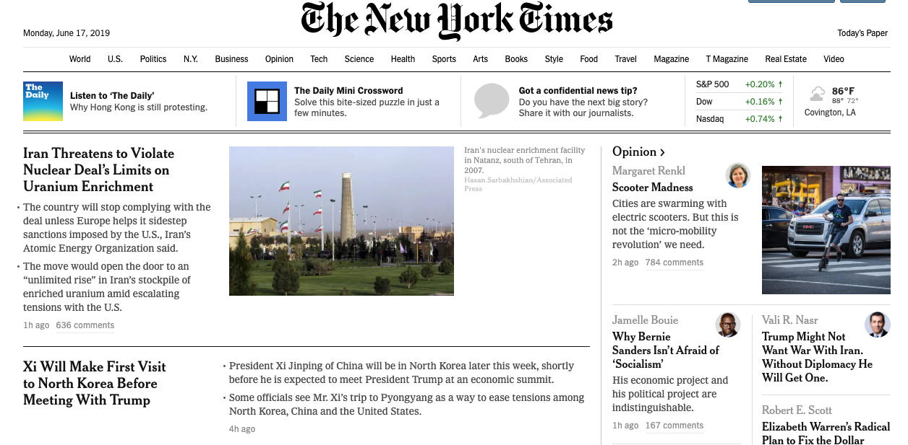

# Introduction to Recommendation Systems 

## Introduction 
This lesson will give you a brief introduction to recommendation system modeling approaches. We will develop intuition into how these systems work and how collaborative filtering is used to make accurate recommendation systems that can harness the power of big data.

## Objectives 

You will be able to:

- Describe the role and rationale for recommendation systems 
- Describe collaborative filtering recommender systems and their benefits/limitations 
- Describe content-based recommenders and their benefits/limitations 
- Define implicit and explicit rating systems 

## Problem Domain 

The goal of a recommendation system is to expose people to items that they will like. In exact terms, a recommendation system predicts the future preference of a set of items for a user, and recommends the top items from this set. In today's world, due to the internet and its global reach, people have more options to choose from than ever before.

Consider buying an album from a traditional music store where the options are always limited and mainly depend upon size and type of the store. There is a physical limitation to how many songs, albums, and artists can be offered. An online product like Spotify, however has a much higher ceiling in terms of storage space. With this new method of selecting products, recommendation systems are a popular way for users to sort through millions of songs to find the ones that are customized exactly for them. Recommendation systems cast a direct impact on profitability and customer satisfaction for most businesses today. With the nearly limitless options consumers have for products online, they need some guidance!

This idea can be represented by a concept called the "Long Tail," which is a set of statistical distributions that have a very long "tail" of the distribution, representing many occurences of low frequency things. In the context of consumer products, there are some products that everyone is going to buy: light bulbs, toilet paper, bread etc. There are also items that are far more obscure: specific toys, sports equipment, movies. Recommendation systems are made to help consumers tap into this long tail to assist them in picking from the endless number of options that are made available to them via the internet.

Here's a formal definition of recommendation systems from authors [Bo Xiao and Izak Benbasat, 2017](https://misq.org/e-commerce-product-recommendation-agents-use-characteristics-and-impact.html)
 :

***Recommendation Systems are software agents that elicit the interests and preferences of individual consumers […] and make recommendations accordingly. They have the potential to support and improve the quality of the
decisions consumers make while searching for and selecting products online.***

## Applications of Recommendation Systems

Let’s understand what all recommendation systems can do for businesses:

- Help in suggesting the merchants/items which a customer might be interested in after buying a product in a marketplace 
- Estimate profit & loss of many competing items and make recommendations to the customer (e.g. buying and selling stocks)
- Based on the experience of the customer, recommend a customer centric or product centric offering  
- Enhance customer engagement by providing offers which can be highly appealing to the customer 

## Recommendation Systems Approaches 

There are two main types of recommendation systems: unpersonalized and personalized. In the majority of this section, we will focus on personalized recommendation systems because that's where data scientists can provide the most value to companies, but to start off, let's investigate some unpersonalized systems because they can be productive in their own right.

### Unpersonalized Recommendations

Unpersonalized recommendation systems have been happening since way before machine learning was ever in the public knowledge base. An example of an unpersonalized recommendation would be on YouTube when it recommends the most viewed videos. These are videos that the most people have watched. For the most part, these recommendations aren't too bad. After all, there's a reason why things are popular. This approach, however, is not going to help more niche videos get exposure. It also won't be immensely beneficial to those who have very particular tastes. Of course, there are times when a simple approach like this might be best. An example of a simple popularity recommender working well is with the news. There's a high chance that everyone who visits a news website is going to want to see whatever is the most popular at that moment in time.

Because unpersonalized recommendations are based on the entire user pool, whatever item is the most popular at any given time would be recommended to you, even if it's something you are completely uninterested in. There are so many items that are far too obscure to be the "most popular" item that might make someone's day. To make more informed recommendations, personalized recommendation systems make use of big data to ensure that users are getting items tailored towards there personal interests, no matter how niche they are.

### Personalized Recommendations

The general problem of personalized recommendation systems can be summarized as:

__Given__: 
The profile of the "active" user and possibly some situational context, i.e. user browsing a product or making a purchase etc. 

__Required__:
Creating a set of items, and a score for each recommendable item in that set

__Profile__:

User profile may contain past purchases, ratings in either implicit or explicit form, demographics and interest scores for item features 

> There are two ways to gather such data. The first method is to ask for explicit ratings from a user, typically on a concrete rating scale (such as rating a movie from one to five stars). The second is to gather data implicitly as the user is in the domain of the system - that is, to log the actions of a user on the site.

__Problem__:
We want to learn a function that predicts the relevance score for a given (typically unseen) item based on user user profile and context 

Within personalized recommendation systems there are many different possible algorithms. We're going to go over the important ones now.

Each of these techniques make use of different similarity metrics to determine how "similar" items are to one another. The most common similarity metrics are [Euclidean distance](https://en.wikipedia.org/wiki/Euclidean_distance), [cosine similarity](https://en.wikipedia.org/wiki/Cosine_similarity), [Pearson correlation](https://en.wikipedia.org/wiki/Pearson_correlation_coefficient) and the [Jaccard index (useful with binary data)](https://en.wikipedia.org/wiki/Jaccard_index). Each one of these distance metrics has its advantages and disadvantages depending on the type of ratings you are using and the characteristics of your data.

### Content-Based Recommenders 

> __Main Idea__: If you like an item, you will also like "similar" items.

These systems are based on the characteristics of the items themselves. If you ever see a banner ad saying "try other items like this", it is most likely a content-based recommender systems. The advantages of content-based recommender systems is that it is a recommender system that gives the user a bit more information as to why they are seeing these recommendations. If they are on a page of a book they very much like, they will be happy to see another book that is similar to it. If they are told that this book is similar to their favorite book, they're more than likely to get that book. A disadvantage of content-based recommender systems is that they often require manual or semi-manual tagging of each of products. More advanced versions of content-based recommender systems allow for the development of an average of all the items a user has liked. This allows for a more nuanced approach to incorporate more than one item when calculating which items are most similar.

### Collaborative Filtering Systems

> __Main Idea__: If user A likes items 5, 6, 7, and 8 and user B likes items 5, 6, and 7, then it is highly likely that user B will also like item 8.

Collaborative filtering systems use a collection of user rating of items to make recommendations. The issue with collaborative filtering is that you have what is called the "cold start problem." The idea behind it is, how to recommend something based off of user activity if you do not have any user activity to begin with! This can be overcome through various techniques. The most important thing to realize is that there is no one best recommendation system technique. In the end, what matters most is what system actually gets people to get recommendations that they will act upon. It might be that on the aggregate, recommending the most popular items is the most cost effective way to introduce users to new products. 

__The key idea behind collaborative filtering is that similar users share similar interests and that users tend to like items that are similar to one another.__

While this may not be completely true on every occasion, if we have a large enough dataset, if there are patterns present, they will start to emerge.
Assume there are some users who have bought certain items, we can use a matrix with size $\text{num_users} * \text{num_items}$ to denote the past behavior of users. Each cell in the matrix represents the associated opinion that a user holds. Such matrix is called a __Utility Matrix__. For instance, $M_{i, j}$ denotes how user $u$ likes item $i$. Sometimes these individual ratings are written as $r_{ui}$ for a rating for a given user and a given item. Using the table below as a reference point, if we replaced the $u$ and $i$ variable subscripts with actual values it would look like $r_{\text{Mike},\text{Little Mermaid}} = 3$.

|        | Toy Story | Cinderella | Little Mermaid | Lion King |
|--------|-----------|------------|----------------|-----------|
| Matt   |           | 2          |                | 5         |
| Lore   | 2         |            | 4              |           |
| Mike   |           | 5          | 3              | 2         |
| Forest | 5         |            | 1              |           |
| Taylor | 1         | 5          |                | 2         |

The task of a recommendation system would be to come up with ratings for users in the spots that are currently empty. As you can imagine, most of the time, these values will be largely empty. For user 1, our recommendation system would try and predict what user 1 would rate Toy Story and the Little Mermaid and then recommend whichever product our model predicts they would rate the highest. The utility matrix above is what's known as an explicit rating. Each person has rated the movies that they've seen. Frequently, we must infer some meaning from the data and use our own judgment to determine how to use it for a recommendation system. Assume that rather than ratings, we only knew whether or not users bought a movie from a streaming website. Let's take a look at what this table would look like:

|        | Toy Story | Cinderella | Little Mermaid | Lion King |
|--------|-----------|------------|----------------|-----------|
| Matt   |           |  1         |                | 1         |
| Lore   | 1         |            | 1              |           |
| Mike   |           | 1          | 1              | 1         |
| Forest | 1         |            | 1              |           |
| Taylor | 1         | 1          |                | 1         |

These are __implicit__ ratings because we are assuming that because a person has bought something, they would like to buy other items like it. Of course, this is not necessarily true, but it's better than nothing!

Within the domain of collaborative filtering, there are both memory-based approaches and model-based approaches that you will learn about in the upcoming lessons.

## Further Reading 

[Chapter 9: Mining of Massive Datasets (MMDS)](http://infolab.stanford.edu/~ullman/mmds/ch9.pdf) - A must read for in-depth knowledge about how recommendation systems work, their underlying algorithms and evaluation approaches. This covers most of the topic from this lesson and also the upcoming lessons in great detail. 

## Summary 

In this lesson, we looked at an overview of recommendation systems. Focusing on collaborative filtering systems, we will move on to developing user-based engines. 
