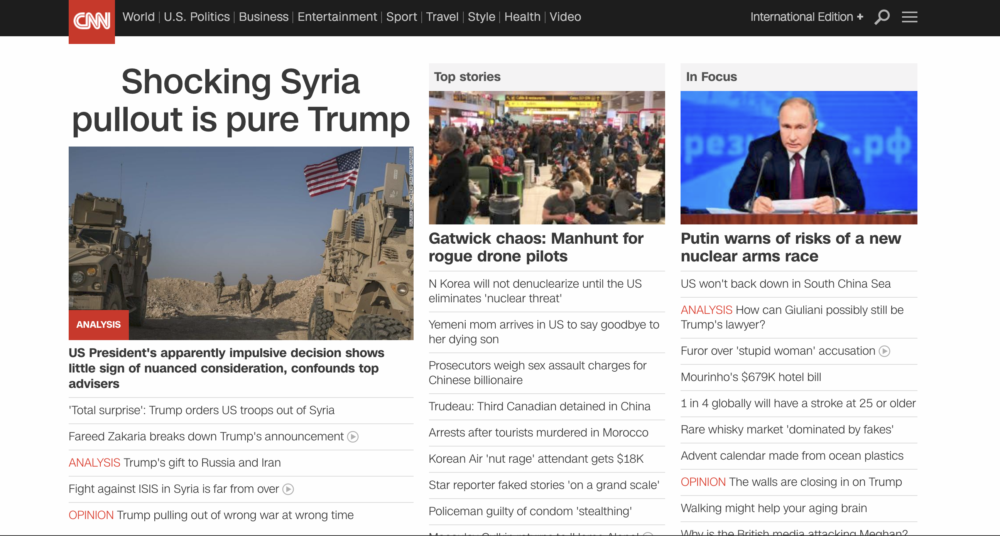
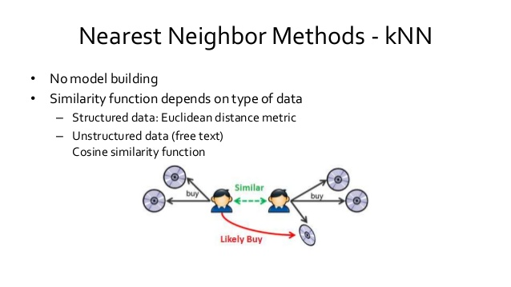
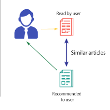
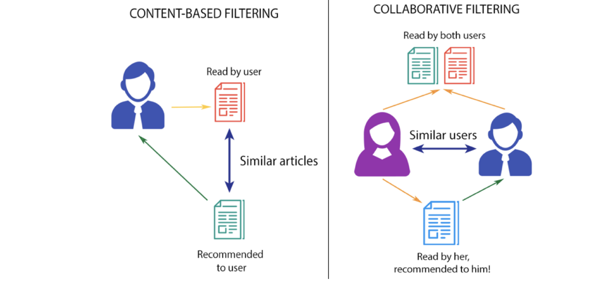

# Introduction to Recommendation Systems 

## Introduction 
Previously, we saw how to develop a simple recommendation system using amazon co-purchase data using network analysis techniques. This lesson will give you a brief introduction to recommendation system modeling approaches. We will develop intuition into how these systems work and how collaborative filtering this is a much superior approach to the simple recommendation systems, like the one we saw with ego network analysis. 

## Objectives 

You will be able to:
- Describe the role and rationale for recommendation systems
- IDentify various classes of recommendation systems and their benefits/limitations
- Understand how collaborative filtering differs from other recommendation approaches 

## Problem Domain 

A recommendation system allows predicting the future preference of a set of items for a user, and recommends the top items from this set. In today's world, people have more options to use from than before,  due to the prevalence of Internet and global reach. 

Consider buying an album from a traditional music store where the options are always limited and mainly depend upon size and type of the store. Now imagine Spotify in comparison to that which increases the options for music listeners by a huge factor. With this new mode of buying, recommendation systems are becoming more popular as it they allow businesses to offer customized suggestions to their customers. Recommendations systems cast a direct impact on profitability and customer satisfaction for most businesses today. 

Here's a formal definition:

***Recommendation Systems are software agents that elicit the interests and preferences of individualconsumers […] and make recommendations accordingly. They have the potential to support and improve the quality of the
decisions consumers make while searching for and selecting products online.***

[Xiao & Benbasat, MISQ, 2007]

__Given__: 
The profile of the "active" user and possibly some situational context i.e. user browsing a product or making a purchase etc. 

__Required__:
Creating a set of closely related items, and a score for each recommendable item in that set
__Profile__:

User Profile may contain past purchases, ratings in either implicit or explicit form, demographics and interest scores for item features 
> There are two ways to gather such data. The first method is to ask for explicit ratings from a user, typically on a concrete rating scale (such as rating a movie from one to five stars). The second is to gather data implicitly as the user is in the domain of the system - that is, to log the actions of a user on the site.

__Problem__:
We want to learn a function that predicts the relevance score for a given (typically unseen) item based on user user profile and context.

## Applications of Recommendation Systems

Let’s understand what all a recommendation systems can do for businesses:

- Help in suggesting the merchants/Items which a customer might be interested in after buying a product in a marketplace.
- Estimate profit & loss of many competing items and make recommendations to the customer (e.g. buying and selling stocks)
- Based on the experience of the customer, recommend a customer centric or product centric offering. 
- Enhance customer engagement by providing offers which can be highly appealing to the customer.

## Recommendation Systems Approaches 

Recommendation systems reduce information overload by estimating relevance here are two methods to construct a RS:

### Recommending the most popular items
A simple approach could be to recommend the items which are liked by most number of users. This is a simple and  fast approach to implement but has a major limitation i.e. __there is no personalization offered by this approach.__

As popularity is defined on the entire user pool, everybody will see the same results. A website recommending you to buy an electric scooter when you have no interest in that would not yield expected results.

However, in some areas of information like news services (BBC, CNN etc.), we see sections on “Popular News” and "Popular Videos" which can be further subdivided into sections and the most viewed content of each sections are displayed. __At a time there are only a few hot topics and there is a high chance that a user wants to read the news which is being read by most others__. Here is the first page for cnn.com as an example.

### Classification Algorithms

We already know many classification algorithms which can be used to make recommendations. Classifiers are parametric solutions so we just need to define some parameters i.e. __features__ of the user and the item. The outcome can be 1 if the user likes it or 0 otherwise. This has advantage of "Personalization" over the popularity model approach. Due to the predictive natural of classification algorithms, such systems work well even if the user’s past history is short or not available.

One of the key limitations for such systems is that the features might actually not be available or even if they are, they may not be sufficient to make a good classifier As the number of users and items grow, making a good classifier will become exponentially difficult. 

Such systems use some sort of similarity measure to find users that are similar in their profile. These may include Euclidean Distance, Jaccard similarity or Cosine Similarity measures etc. 

Visit here to see how [to use a simple KNN classifier to make recommendations](http://rnowling.github.io/data/science/2016/10/29/knn-recsys.html)

## Recommendation Algorithms

These algorithms are tailor-made for solving the recommendation problem. There are typically two types of algorithms: __Content Based__ and __Collaborative Filtering__. Visit [Here](https://codeburst.io/explanation-of-recommender-systems-in-information-retrieval-13077e1d916c) for an excellent explanation of these algorithmic approaches.

### Content based algorithms:

> If you like an item then you will also like a “similar” item Based on similarity of the items being recommended

As the name suggest, these algorithms are strongly based on driving the context of the item. Once you have gathered this context level information on items, you try to find look alike items and recommend them. For instance on Youtube, you can find genre, language, starring of a video. Now based on these information we can find look alike (related) of these videos. Once we have look alike, we simply recommend these videos to a customer who originally saw the first video only. Such algorithms are very common in video online channels, song online stores etc. Plausible reason being, such context level information is far easier to get when the product/item can be explained with few dimensions.

### Collaborative Filtering algorithms:
> If a person A likes item 1, 2, 3 and B like 2,3,4 then they have similar interests and A should like item 4 and B should like item 1.

This algorithm is entirely based on the past behavior and not on the context. This makes it one of the most commonly used algorithm as it is not dependent on any additional information. For instance: product recommendations by e-commerce player like Amazon and merchant recommendations by banks like American Express.

Further, there are several types of collaborative filtering algorithms :

__User-User Collaborative filtering:__
Here we find look alike customers (based on similarity) and offer products which first customer’s look alike has chosen in past. This algorithm is very effective but takes a lot of time and resources. It requires to compute every customer pair information which takes time. Therefore, for big base platforms, this algorithm is hard to implement without a very strong parallelizable system.

__Item-Item Collaborative filtering:__
It is quite similar to previous algorithm, but instead of finding customer look alike, we try finding item look alike. Once we have item look alike matrix, we can easily recommend alike items to customer who have purchased any item from the store. This algorithm is far less resource consuming than user-user collaborative filtering. Hence, for a new customer the algorithm takes far lesser time than user-user collaborate as we don’t need all similarity scores between customers. And with fixed number of products, product-product look alike matrix is fixed over time.
Other simpler algorithms: There are other approaches like market basket analysis, which generally do not have high predictive power than the algorithms described above.
 

Next we shall look at collobartive filtering in more detail and see how it works under the hood . 

## Further Reading 

[Chapter 9: Mining of Massive Datasets (MMDS)](http://infolab.stanford.edu/~ullman/mmds/ch9.pdf) - A must read for indepth knowledge about how recommendation systems work, their underlying algorithms and evaluation approaches. This covers most of the topic from this lesson and also the upcoming lessons in great detail. 

## Summary 

In this lesson , we looked at an overview of recommendation systems. IN addition to the graph the based recommendation systems that we have seen previously, we looked at major classes of such systems and how do they differ from each other. Focusing at the collaborative filtering, we shall move on to developing an user based engine in PySpark. 
